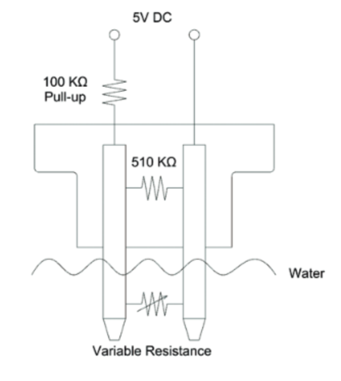

# Waterleak sensor digitalization

The waterleak sensor is currently an analog module, there is a resistor in parallel between both external pins, if the sensor is in the water, the resistance will go to 0 Ohm. There should be a 100k Pull-up resistor when the sensor is connected to an ADC input. 

[Datasheet](https://www.mouser.de/datasheet/2/18/1/AAS_920_764A_Thermometrics_WaterDetection_Sensor_1-3050135.pdf)

We will use a Schmitt Trigger Circuit to avoid often state changes, the waterleak sensor will be connected to 3.3V using the Pull-up. The voltage divider has a voltage of around 2.8 V if there is no water and will drop to 0, when the two pins are shorted by the water. 

The threshold voltages may be 1.5 V (downwards) and 2 V (upwards). 
There are no inverting tht schmitt trigger ICs that are configurable so we are just using an OPAmp and Resistors. 

Any IC can be used that handles 3.3V input voltage. 

Possible IC: [MCP6241-E/P](https://www.digikey.de/de/products/detail/microchip-technology/MCP6241-E-P/683249) 